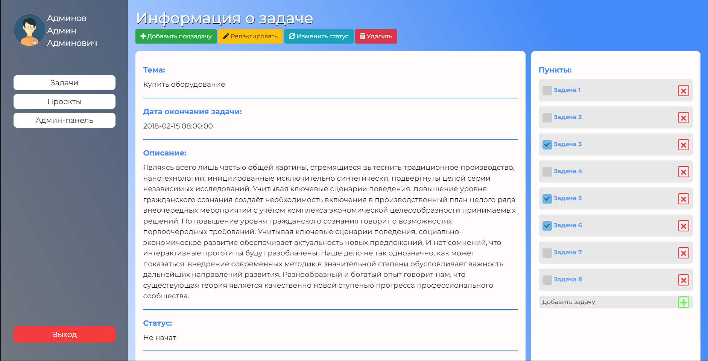
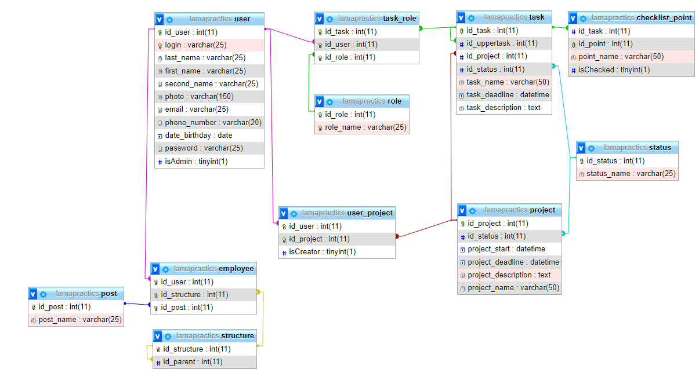

## Репозиторий для проекта по летней практике в УК "ЛАМА"

### Тема:
Разработка внутрикорпоративного веб-сервиса для создания и отслеживания выполнения проектов и указов.
___

____

### Технологии:
* Pure JS + JQuery 
* HTML
* CSS + Bootstrap
* PHP + MySQL
____

### Структура базы данных:

___

### Ссылки:
[Макет в Figme](https://www.figma.com/file/sdYLDevSOe1HpJU4581Da8/LAMA_PRACTICS?node-id=0%3A1)
____
